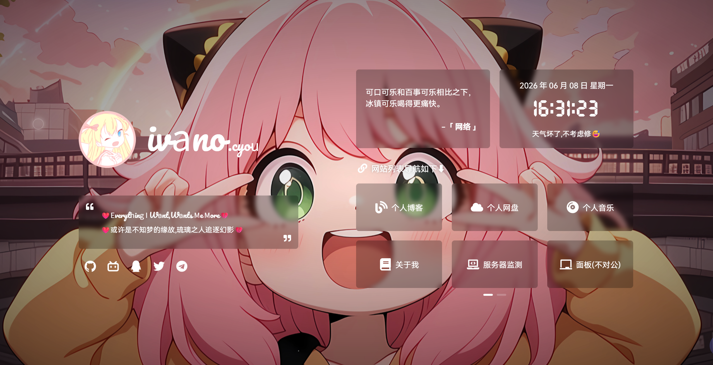
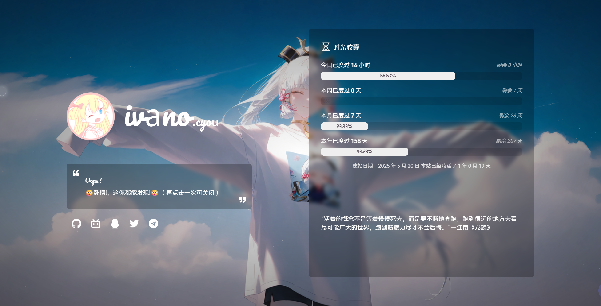

# Personal WebDisplay

我的个人主页导航项目

基于 imsyy 的 WebStack 项目二次开发。

---

## 项目介绍

这是我的个人主页导航站，用于展示：

- 个人简介
- 常用网站导航
- 社交媒体链接
- 音乐播放器
- 时间与天气组件

---

## 技术栈

- Vue3
- Vite
- JavaScript
- SCSS

---

## 在线访问

https://ivano.cyou

---

## 项目截图

### Windows段

### Android端

---

## 致谢

原项目作者：

https://github.com/imsyy

---

## License

MIT License